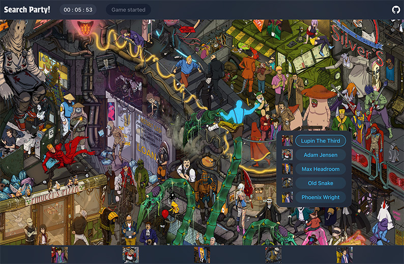

This photo-tag-frontend project features:

- Typescript
- A frontend for an online Where's Waldo game called "Search Party!"
- React
- RESTful API consumption via Axios
- Tailwind
- Vite

This frontend is to be used with my photo-tag-backend repository. All game
logic is held on the backend to prevent cheating. Users are randomly served 5
various "Waldos" from many different franchises to find for a chance to put
their name on the leaderboard.

